# Architecture

## Scenario View

### Goals

The primary goal is to enhance ordinary web browsing with lightweight social reactions from the user's Fediverse account.

The secondary goal is to serve as a test implementation for [ActivityPub HTML Discovery](https://swicg.github.io/activitypub-html-discovery/), exercising discovery from browser-accessible HTML pages to ActivityPub actors and objects.

The project also tracks the standard [ActivityPub client-to-server API](https://www.w3.org/TR/activitypub/#client-to-server-interactions) as a target interface alongside Mastodon-compatible APIs.

### Non-Goals

The extension is not a full Mastodon or Fediverse client. It does not provide timelines, notifications, search, account management beyond login and logout, or general social-network navigation.

### Persona

#### Fediverse User

A person with an account on a Fediverse server who wants to react socially to ActivityPub actors and objects encountered while browsing the web.

### Use Cases

#### Log Into Mastodon Server

The user authenticates with their Mastodon server so the extension can perform social actions on their behalf.

#### Log Into ActivityPub API Server

The user authenticates with an ActivityPub server that supports the standard ActivityPub client-to-server API so the extension can perform social actions on their behalf.

#### Discover ActivityPub Resource On Current Page

The extension identifies whether the current page represents or links to an ActivityPub object or actor using ActivityPub HTML Discovery mechanisms.

#### Like Object On Current Page

The user likes an ActivityPub object represented by the current browser page.

#### Undo Like Object On Current Page

The user removes their like from the ActivityPub object represented by the current browser page.

#### Share Object On Current Page

The user shares an ActivityPub object represented by the current browser page, using the server's boost or announce behavior.

#### Undo Share Object On Current Page

The user removes their share of the ActivityPub object represented by the current browser page.

#### Follow Actor On Current Profile Page

The user follows the ActivityPub actor represented by the current browser page.

#### Undo Follow Actor On Current Profile Page

The user stops following the ActivityPub actor represented by the current profile page.

#### Mention Actor On Current Profile Page

The user mentions the ActivityPub actor represented by the current profile page.

#### Follow Author Of Object On Current Page

The user follows the author of the ActivityPub object represented by the current page.

#### Undo Follow Author Of Object On Current Page

The user stops following the author of the ActivityPub object represented by the current page.

#### Mention Author Of Object On Current Page

The user mentions the author of the ActivityPub object represented by the current page.

#### Reply To Object On Current Page

The user replies to, or comments on, an ActivityPub object represented by the current browser page.

#### See Followed Users Who Liked Object On Current Page

The user sees which actors they follow have liked the ActivityPub object represented by the current page. This use case depends on ActivityPub Social API capabilities that can query social context for the user's account.

#### See Followed Users Who Shared Object On Current Page

The user sees which actors they follow have shared the ActivityPub object represented by the current page. This use case depends on ActivityPub Social API capabilities that can query social context for the user's account.

#### See Followed Users Who Follow Actor On Current Profile Page

The user sees which actors they follow also follow the ActivityPub actor represented by the current profile page. This use case depends on ActivityPub Social API capabilities that can query social context for the user's account.

#### See Followed Users Who Follow Author Of Object On Current Page

The user sees which actors they follow also follow the author of the ActivityPub object represented by the current page. This use case depends on ActivityPub Social API capabilities that can query social context for the user's account.

#### See Whether I Already Follow Actor On Current Profile Page

The user sees whether they already follow the ActivityPub actor represented by the current profile page.

#### See Whether I Already Follow Author Of Object On Current Page

The user sees whether they already follow the author of the ActivityPub object represented by the current page.

#### See Whether I Already Liked Object On Current Page

The user sees whether they have already liked the ActivityPub object represented by the current page.

#### See Whether I Already Shared Object On Current Page

The user sees whether they have already shared the ActivityPub object represented by the current page.

#### See Public Replies To Object On Current Page

The user sees public replies or comments associated with the ActivityPub object represented by the current page.

#### Open Object In Mastodon Server

The user opens the ActivityPub object represented by the current page in their Mastodon server's web interface.

#### Open Actor In Mastodon Server

The user opens the ActivityPub actor represented by the current page in their Mastodon server's web interface.

#### Copy Fediverse Link For Current Page

The user copies a Fediverse-aware link to the ActivityPub object or actor represented by the current page.

#### Log Out Of Mastodon Server

The user removes their authenticated session from the extension.

#### Log Out Of ActivityPub API Server

The user removes their authenticated ActivityPub API session from the extension.

### Use-Case Diagram

```mermaid
flowchart LR
    user[Fediverse User]

    subgraph extension[ActivityPub Browser Extension]
        loginMastodon([Log into Mastodon server])
        loginActivityPub([Log into ActivityPub API server])
        discover([Discover ActivityPub resource on current page])
        like([Like object on current page])
        undoLike([Undo like object on current page])
        share([Share object on current page])
        undoShare([Undo share object on current page])
        follow([Follow actor on current profile page])
        undoFollow([Undo follow actor on current profile page])
        mentionActor([Mention actor on current profile page])
        followAuthor([Follow author of object on current page])
        undoFollowAuthor([Undo follow author of object on current page])
        mentionAuthor([Mention author of object on current page])
        reply([Reply to object on current page])
        followedLiked([See followed users who liked object on current page])
        followedShared([See followed users who shared object on current page])
        followedFollowActor([See followed users who follow actor on current profile page])
        followedFollowAuthor([See followed users who follow author of object on current page])
        alreadyFollowActor([See whether I already follow actor on current profile page])
        alreadyFollowAuthor([See whether I already follow author of object on current page])
        alreadyLiked([See whether I already liked object on current page])
        alreadyShared([See whether I already shared object on current page])
        publicReplies([See public replies to object on current page])
        openObject([Open object in Mastodon server])
        openActor([Open actor in Mastodon server])
        copyLink([Copy Fediverse link for current page])
        logoutMastodon([Log out of Mastodon server])
        logoutActivityPub([Log out of ActivityPub API server])
    end

    user --> loginMastodon
    user --> loginActivityPub
    user --> like
    user --> undoLike
    user --> share
    user --> undoShare
    user --> follow
    user --> undoFollow
    user --> mentionActor
    user --> followAuthor
    user --> undoFollowAuthor
    user --> mentionAuthor
    user --> reply
    user --> followedLiked
    user --> followedShared
    user --> followedFollowActor
    user --> followedFollowAuthor
    user --> alreadyFollowActor
    user --> alreadyFollowAuthor
    user --> alreadyLiked
    user --> alreadyShared
    user --> publicReplies
    user --> openObject
    user --> openActor
    user --> copyLink
    user --> logoutMastodon
    user --> logoutActivityPub

    like -. requires .-> discover
    undoLike -. requires .-> discover
    share -. requires .-> discover
    undoShare -. requires .-> discover
    follow -. requires .-> discover
    undoFollow -. requires .-> discover
    mentionActor -. requires .-> discover
    followAuthor -. requires .-> discover
    undoFollowAuthor -. requires .-> discover
    mentionAuthor -. requires .-> discover
    reply -. requires .-> discover
    followedLiked -. requires .-> discover
    followedShared -. requires .-> discover
    followedFollowActor -. requires .-> discover
    followedFollowAuthor -. requires .-> discover
    alreadyFollowActor -. requires .-> discover
    alreadyFollowAuthor -. requires .-> discover
    alreadyLiked -. requires .-> discover
    alreadyShared -. requires .-> discover
    publicReplies -. requires .-> discover
    openObject -. requires .-> discover
    openActor -. requires .-> discover
    copyLink -. requires .-> discover
```

## Logical View

## Process View

## Development View

## Physical View
