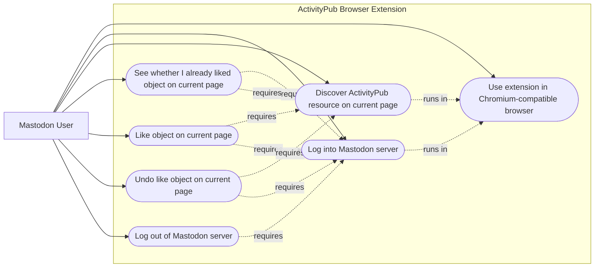
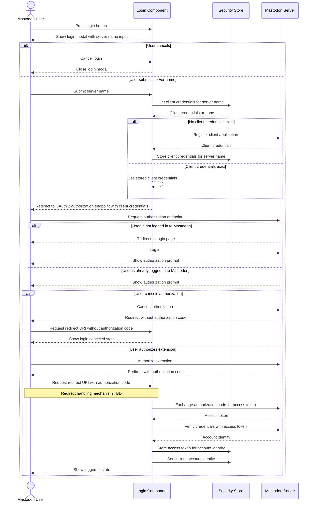
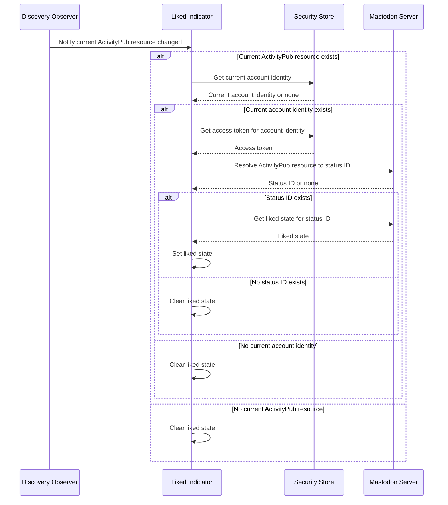
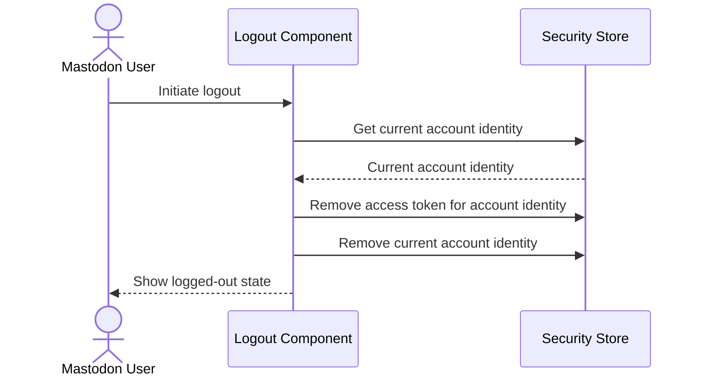

# Architecture

## Scenario View

### Goals

The primary goal for milestone 1.0 is to let a user like and unlike ActivityPub objects from ordinary web pages, using their Mastodon account, in a Chromium-compatible browser extension.

The secondary goal is to serve as a test implementation for [ActivityPub HTML Discovery](https://swicg.github.io/activitypub-html-discovery/), exercising discovery from browser-accessible HTML pages to ActivityPub actors and objects.

### Non-Goals

The milestone 1.0 extension is not a full Mastodon or Fediverse client. It does not provide timelines, notifications, search, posting, sharing, following, replying, account management beyond login and logout, or general social-network navigation.

Milestone 1.0 targets the Chromium extension ecosystem only. Firefox compatibility, cross-browser abstraction, and browser-specific packaging for non-Chromium browsers are deferred.

Milestone 1.0 uses Mastodon-compatible APIs only. The standard [ActivityPub client-to-server API](https://www.w3.org/TR/activitypub/#client-to-server-interactions) is deferred.

### Persona

#### Mastodon User

A person with an account on a Mastodon-compatible server who wants to like and unlike ActivityPub objects encountered while browsing the web.

### Use Cases

Milestone 1.0 has seven use cases.

#### Log Into Mastodon Server

The user authenticates with their Mastodon server so the extension can perform social actions on their behalf.

#### Discover ActivityPub Resource On Current Page

The extension identifies whether the current page represents or links to an ActivityPub object using ActivityPub HTML Discovery mechanisms.

Actor discovery may be recognized as part of the discovery result model, but actor-specific actions are outside milestone 1.0.

#### See Whether I Already Liked Object On Current Page

The user sees whether they have already liked the ActivityPub object represented by the current page.

#### Like Object On Current Page

The user likes an ActivityPub object represented by the current browser page.

#### Undo Like Object On Current Page

The user removes their like from the ActivityPub object represented by the current browser page.

#### Log Out Of Mastodon Server

The user removes their authenticated session from the extension.

#### Use Extension In Chromium-Compatible Browser

The user installs and runs the extension in a Chromium-compatible browser using Manifest V3 extension APIs.

### Use-Case Diagram

## Process View

### Log Into Mastodon Server

### Discover ActivityPub Resource On Current Page

```mermaid
sequenceDiagram
    actor User as Mastodon User
    participant Browser
    participant Observer as Discovery Observer
    participant Cache as Resource Cache
    participant Document as DOM Document
    participant Security as Security Store
    participant Mastodon as Mastodon Server

    User->>Browser: Change current tab document or location
    Browser->>Observer: Notify document or location changed
    Observer->>Observer: Clear current ActivityPub resource
    Observer->>Cache: Get ActivityPub resource for document
    Cache-->>Observer: ActivityPub resource or none

    alt Resource is cached
        Observer->>Observer: Set current ActivityPub resource
    else Resource is not cached
        Observer->>Browser: Get response headers
        Browser-->>Observer: Response headers
        Observer->>Observer: Find ActivityPub Link header

        alt ActivityPub Link header found
            Observer->>Observer: Use Link header resource
        else No ActivityPub Link header found
            Observer->>Browser: Get DOM document
            Browser-->>Observer: DOM document
            Observer->>Document: Find ActivityPub link element
            Document-->>Observer: ActivityPub resource or none

            alt ActivityPub link element found
                Observer->>Observer: Use link element resource
            else No ActivityPub link element found
                Observer->>Document: Find ActivityPub anchor element
                Document-->>Observer: ActivityPub resource or none

                alt ActivityPub anchor element found
                    Observer->>Observer: Use anchor element resource
                else No ActivityPub anchor element found
                    Observer->>Document: Find embedded JSON-LD
                    Document-->>Observer: ActivityPub resource or none

                    alt Embedded JSON-LD found
                        Observer->>Observer: Use embedded JSON-LD resource
                    else No embedded JSON-LD found
                        Observer->>Browser: Fetch document using ActivityPub content negotiation
                        Browser-->>Observer: ActivityPub resource or none

                        alt Content negotiation found ActivityPub resource
                            Observer->>Observer: Use content negotiation resource
                        else Content negotiation did not find ActivityPub resource
                            Observer->>Browser: Fetch WebFinger resource
                            Browser-->>Observer: ActivityPub resource or none

                            alt WebFinger found ActivityPub resource
                                Observer->>Observer: Use WebFinger resource
                            end
                        end
                    end
                end
            end
        end

        alt ActivityPub resource found
            Observer->>Observer: Verify same-origin resource

            alt Same-origin verification succeeds
                Observer->>Observer: Mark resource verified
            else Same-origin verification does not succeed
                Observer->>Security: Get current account identity
                Security-->>Observer: Current account identity or none

                alt Current account identity exists
                    Observer->>Security: Get access token for account identity
                    Security-->>Observer: Access token
                    Observer->>Mastodon: Resolve ActivityPub resource with access token
                    Mastodon-->>Observer: ActivityPub object or none

                    alt ActivityPub object returned
                        Observer->>Observer: Verify object url matches current page
                        alt Object url matches current page
                            Observer->>Observer: Mark resource verified
                        else Object url does not match current page
                            Observer->>Observer: Mark resource not verified
                        end
                    else No ActivityPub object returned
                        Observer->>Observer: Mark resource not verified
                    end
                else No current account identity
                    Observer->>Observer: Mark resource not verified
                end
            end
        else No ActivityPub resource found
            Observer->>Observer: Mark resource not verified
        end

        alt Resource is verified
            Observer->>Cache: Store ActivityPub resource for document
            Note over Observer,Cache: Cache invalidation TBD
            Observer->>Observer: Set current ActivityPub resource
        else Resource is not verified
            Observer->>Observer: Clear current ActivityPub resource
        end
    end
```

### See Whether I Already Liked Object On Current Page

### Like Object On Current Page

### Undo Like Object On Current Page

### Log Out Of Mastodon Server

## Logical View

## Development View

## Physical View
