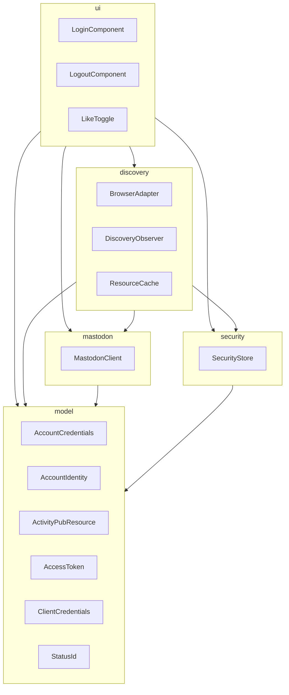

# Development View

```mermaid
flowchart TB
    subgraph ui[ui]
        LoginComponent[LoginComponent]
        LogoutComponent[LogoutComponent]
        LikeToggle[LikeToggle]
    end

    subgraph discovery[discovery]
        BrowserAdapter[BrowserAdapter]
        DiscoveryObserver[DiscoveryObserver]
        ResourceCache[ResourceCache]
    end

    subgraph mastodon[mastodon]
        MastodonClient[MastodonClient]
    end

    subgraph security[security]
        SecurityStore[SecurityStore]
    end

    subgraph model[model]
        AccountCredentials[AccountCredentials]
        AccountIdentity[AccountIdentity]
        ActivityPubResource[ActivityPubResource]
        AccessToken[AccessToken]
        ClientCredentials[ClientCredentials]
        StatusId[StatusId]
    end

    ui --> discovery
    ui --> security
    ui --> mastodon
    ui --> model
    discovery --> security
    discovery --> mastodon
    discovery --> model
    mastodon --> model
    security --> model
```
