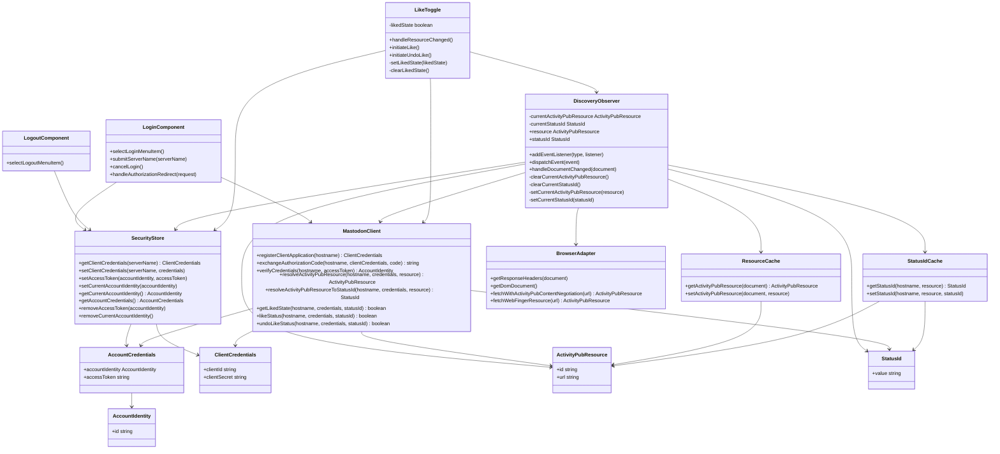

# Logical View

```mermaid
classDiagram
    class LoginComponent {
        +selectLoginMenuItem()
        +submitServerName(serverName)
        +cancelLogin()
        +handleAuthorizationRedirect(request)
    }

    class LogoutComponent {
        +selectLogoutMenuItem()
    }

    class DiscoveryObserver {
        -currentActivityPubResource ActivityPubResource
        -currentStatusId StatusId
        +addEventListener(type, listener)
        +dispatchEvent(event)
        +handleDocumentChanged(document)
        +resource ActivityPubResource
        +statusId StatusId
        -clearCurrentActivityPubResource()
        -clearCurrentStatusId()
        -setCurrentActivityPubResource(resource)
        -setCurrentStatusId(statusId)
    }

    class LikeToggle {
        -likedState boolean
        +handleResourceChanged()
        +initiateLike()
        +initiateUndoLike()
        -setLikedState(likedState)
        -clearLikedState()
    }

    class SecurityStore {
        +getClientCredentials(serverName) ClientCredentials
        +setClientCredentials(serverName, credentials)
        +setAccessToken(accountIdentity, accessToken)
        +setCurrentAccountIdentity(accountIdentity)
        +getCurrentAccountIdentity() AccountIdentity
        +getAccountCredentials() AccountCredentials
        +removeAccessToken(accountIdentity)
        +removeCurrentAccountIdentity()
    }

    class ResourceCache {
        +getActivityPubResource(document) ActivityPubResource
        +setActivityPubResource(document, resource)
    }

    class StatusIdCache {
        +getStatusId(hostname, resource) StatusId
        +setStatusId(hostname, resource, statusId)
    }

    class BrowserAdapter {
        +getResponseHeaders(document)
        +getDomDocument()
        +fetchWithActivityPubContentNegotiation(url) ActivityPubResource
        +fetchWebFingerResource(url) ActivityPubResource
    }

    class MastodonClient {
        +registerClientApplication(hostname) ClientCredentials
        +exchangeAuthorizationCode(hostname, clientCredentials, code) string
        +verifyCredentials(hostname, accessToken) AccountIdentity
        +resolveActivityPubResource(hostname, credentials, resource) ActivityPubResource
        +resolveActivityPubResourceToStatusId(hostname, credentials, resource) StatusId
        +getLikedState(hostname, credentials, statusId) boolean
        +likeStatus(hostname, credentials, statusId) boolean
        +undoLikeStatus(hostname, credentials, statusId) boolean
    }

    class AccountCredentials {
        +accountIdentity AccountIdentity
        +accessToken string
    }

    class ClientCredentials {
        +clientId string
        +clientSecret string
    }

    class ActivityPubResource {
        +id string
        +url string
    }

    class StatusId {
        +value string
    }

    class AccountIdentity {
        +id string
    }

    LoginComponent --> SecurityStore
    LoginComponent --> MastodonClient
    LogoutComponent --> SecurityStore
    DiscoveryObserver --> BrowserAdapter
    DiscoveryObserver --> ResourceCache
    DiscoveryObserver --> StatusIdCache
    DiscoveryObserver --> SecurityStore
    DiscoveryObserver --> MastodonClient
    DiscoveryObserver --> ActivityPubResource
    DiscoveryObserver --> StatusId
    LikeToggle --> DiscoveryObserver
    LikeToggle --> SecurityStore
    LikeToggle --> MastodonClient
    SecurityStore --> ClientCredentials
    SecurityStore --> AccountCredentials
    AccountCredentials --> AccountIdentity
    MastodonClient --> ClientCredentials
    MastodonClient --> AccountCredentials
    MastodonClient --> ActivityPubResource
    MastodonClient --> StatusId
    ResourceCache --> ActivityPubResource
    StatusIdCache --> ActivityPubResource
    StatusIdCache --> StatusId
```
