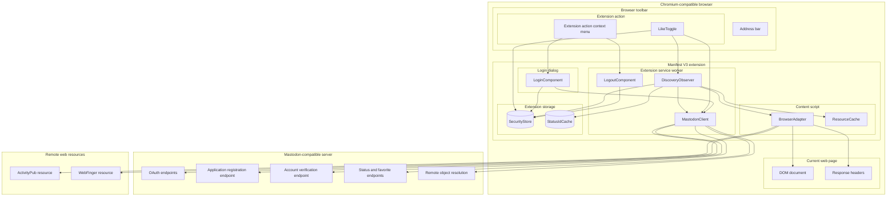

# Physical View

```mermaid
flowchart TB
    subgraph browser[Chromium-compatible browser]
        subgraph toolbar[Browser toolbar]
            urlbar[Address bar]
            subgraph action[Extension action]
                LikeToggle[LikeToggle]
                menu[Extension action context menu]
            end
        end

        subgraph extension[Manifest V3 extension]
            subgraph dialog[Login dialog]
                LoginComponent[LoginComponent]
            end

            subgraph worker[Extension service worker]
                DiscoveryObserver[DiscoveryObserver]
                LogoutComponent[LogoutComponent]
                MastodonClient[MastodonClient]
            end

            subgraph content[Content script]
                BrowserAdapter[BrowserAdapter]
                ResourceCache[ResourceCache]
            end

            subgraph storage[Extension storage]
                SecurityStore[(SecurityStore)]
                StatusIdCache[(StatusIdCache)]
            end
        end

        subgraph page[Current web page]
            dom[DOM document]
            headers[Response headers]
        end
    end

    subgraph mastodon[Mastodon-compatible server]
        oauth[OAuth endpoints]
        apps[Application registration endpoint]
        accounts[Account verification endpoint]
        statuses[Status and favorite endpoints]
        resolve[Remote object resolution]
    end

    subgraph web[Remote web resources]
        activitypub[ActivityPub resource]
        webfinger[WebFinger resource]
    end

    menu --> LoginComponent
    menu --> LogoutComponent
    LoginComponent --> SecurityStore
    LoginComponent --> MastodonClient
    LogoutComponent --> SecurityStore
    LikeToggle --> DiscoveryObserver
    LikeToggle --> SecurityStore
    LikeToggle --> MastodonClient
    DiscoveryObserver --> BrowserAdapter
    DiscoveryObserver --> ResourceCache
    DiscoveryObserver --> StatusIdCache
    DiscoveryObserver --> SecurityStore
    DiscoveryObserver --> MastodonClient
    BrowserAdapter --> dom
    BrowserAdapter --> headers
    MastodonClient --> oauth
    MastodonClient --> apps
    MastodonClient --> accounts
    MastodonClient --> statuses
    MastodonClient --> resolve
    BrowserAdapter --> activitypub
    BrowserAdapter --> webfinger
```
