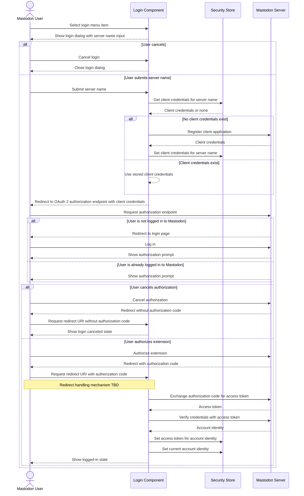
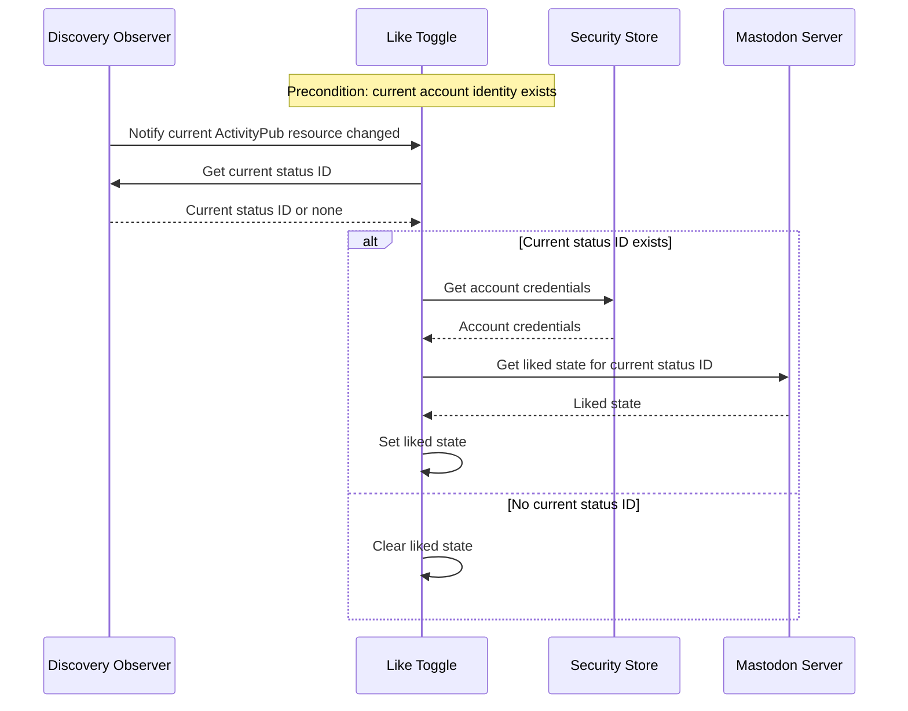
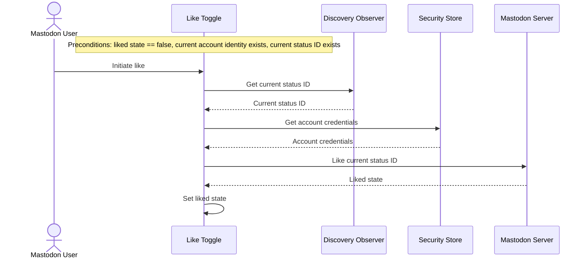
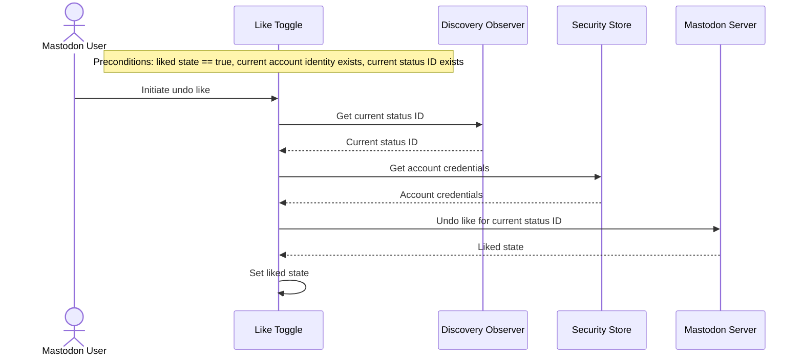
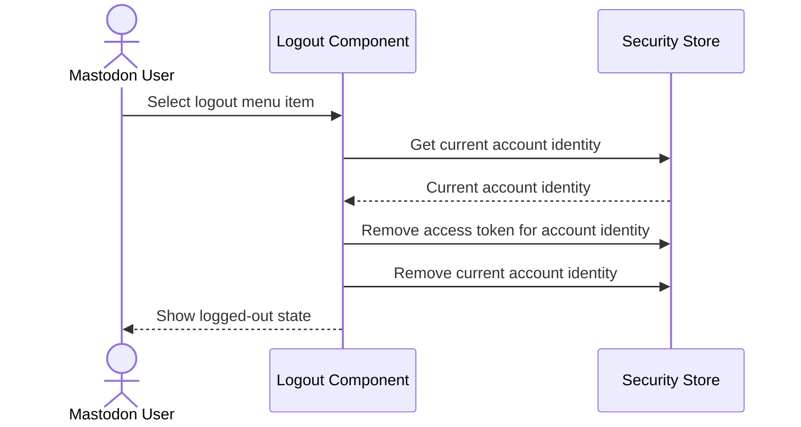

# Process View

## Log Into Mastodon Server

## Discover ActivityPub Resource On Current Page

```mermaid
sequenceDiagram
    actor User as Mastodon User
    participant Browser
    participant Observer as Discovery Observer
    participant Cache as Resource Cache
    participant Document as DOM Document
    participant Security as Security Store
    participant Mastodon as Mastodon Server

    Note over Observer: Precondition: current account identity exists
    User->>Browser: Change current tab document or location
    Browser->>Observer: Notify document or location changed
    Observer->>Observer: Clear current ActivityPub resource
    Observer->>Observer: Clear current status ID
    Observer->>Cache: Get ActivityPub resource for document
    Cache-->>Observer: ActivityPub resource or none

    alt Resource is cached
        Observer->>Security: Get account credentials
        Security-->>Observer: Account credentials
        Observer->>Mastodon: Resolve ActivityPub resource to status ID
        Mastodon-->>Observer: Status ID or none
        Observer->>Observer: Set current status ID

        Observer->>Observer: Set current ActivityPub resource
    else Resource is not cached
        Observer->>Browser: Get response headers
        Browser-->>Observer: Response headers
        Observer->>Observer: Find ActivityPub Link header

        alt ActivityPub Link header found
            Observer->>Observer: Use Link header resource
        else No ActivityPub Link header found
            Observer->>Browser: Get DOM document
            Browser-->>Observer: DOM document
            Observer->>Document: Find ActivityPub link element
            Document-->>Observer: ActivityPub resource or none

            alt ActivityPub link element found
                Observer->>Observer: Use link element resource
            else No ActivityPub link element found
                Observer->>Document: Find ActivityPub anchor element
                Document-->>Observer: ActivityPub resource or none

                alt ActivityPub anchor element found
                    Observer->>Observer: Use anchor element resource
                else No ActivityPub anchor element found
                    Observer->>Document: Find embedded JSON-LD
                    Document-->>Observer: ActivityPub resource or none

                    alt Embedded JSON-LD found
                        Observer->>Observer: Use embedded JSON-LD resource
                    else No embedded JSON-LD found
                        Observer->>Browser: Fetch document using ActivityPub content negotiation
                        Browser-->>Observer: ActivityPub resource or none

                        alt Content negotiation found ActivityPub resource
                            Observer->>Observer: Use content negotiation resource
                        else Content negotiation did not find ActivityPub resource
                            Observer->>Browser: Fetch WebFinger resource
                            Browser-->>Observer: ActivityPub resource or none

                            alt WebFinger found ActivityPub resource
                                Observer->>Observer: Use WebFinger resource
                            end
                        end
                    end
                end
            end
        end

        alt ActivityPub resource found
            Observer->>Observer: Verify same-origin resource

            alt Same-origin verification succeeds
                Observer->>Observer: Mark resource verified
            else Same-origin verification does not succeed
                Observer->>Security: Get account credentials
                Security-->>Observer: Account credentials

                Observer->>Mastodon: Resolve ActivityPub resource with access token
                Mastodon-->>Observer: ActivityPub object or none

                alt ActivityPub object returned
                    Observer->>Observer: Verify object url matches current page
                    alt Object url matches current page
                        Observer->>Observer: Mark resource verified
                    else Object url does not match current page
                        Observer->>Observer: Mark resource not verified
                    end
                else No ActivityPub object returned
                    Observer->>Observer: Mark resource not verified
                end
            end
        else No ActivityPub resource found
            Observer->>Observer: Mark resource not verified
        end

        alt Resource is verified
            Observer->>Security: Get account credentials
            Security-->>Observer: Account credentials

            Observer->>Mastodon: Resolve ActivityPub resource to status ID
            Mastodon-->>Observer: Status ID or none
            Observer->>Observer: Set current status ID

            Observer->>Cache: Store ActivityPub resource for document
            Note over Observer,Cache: Cache invalidation TBD
            Observer->>Observer: Set current ActivityPub resource
        else Resource is not verified
            Observer->>Observer: Clear current ActivityPub resource
            Observer->>Observer: Clear current status ID
        end
    end
```

## See Whether I Already Liked Object On Current Page

## Like Object On Current Page

## Undo Like Object On Current Page

## Log Out Of Mastodon Server

